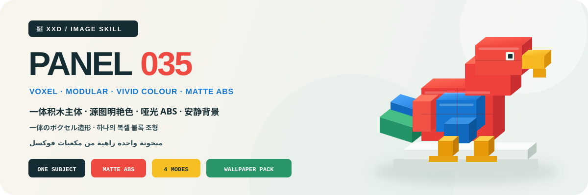

<p align="center">
  
</p>

<div align="center" dir="rtl">

# 🦁 XXD Panel 035

### يعيد بناء الصورة كقطعة فنية واحدة زاهية من مكعبات فوكسل قابلة للاقتناء

[](./SKILL.md)
[](#أربعة-مخرجات-ونظام-واحد-للنحت-بمكعبات-فوكسل)
[](#الحدود-والثقة)

<a href="README.md">简体中文</a> · <a href="README.en.md">English</a> · <a href="README.ja.md">日本語</a> · <a href="README.ko.md">한국어</a> · <strong>العربية</strong>

</div>

<div dir="rtl">

> موضوع مكعّب واحد · لون حي من المصدر · بلاستيك ABS مطفأ · خلفية هادئة · كتابة معيارية

XXD Panel 035 مهارة لتوليد الصور مخصّصة لـ Codex والوكلاء المتوافقين. تفهم هوية الموضوع وحركته ووظيفته وعلاقته ودلالته، ثم تعيد بناءه كمنحوتة واحدة من مكعبات فوكسل بروح LEGO／Minecraft مع حفظ ثلاث علامات خاصة بالمصدر على الأقل.

تجعل النسب المكعبة والسماكة والدرجات والفواصل والوصلات والتراكب وتوزيع الوزن التجميع معقولاً، بينما تمنحه الألوان الصافية الزاهية المستخرجة من المصدر وبلاستيك ABS المطفأ والانعكاس الهادئ والخلفية الفاتحة حضور قطعة فنية ممتازة لا صورة مبكسلة.

## لماذا توجد 035؟

ينحدر «تحويل الصورة إلى مكعبات» بسهولة إلى رسم مبكسل خشن أو شبكة منخفضة المضلعات أو شاشة لعبة أو صورة منتج أو عدة ألوان أولية ثابتة لا علاقة لها بالمصدر.

تعكس 035 هذا الترتيب:

```text
فهم الموضوع والحركة والوظيفة والعلاقة والدلالة ← تثبيت ثلاث علامات خاصة أو أكثر ← التبسيط إلى موضوع مكعّب واحد ← تصميم النسب والتجميع ← إثبات السماكة والدرجات والفواصل والوصلات والوزن ← توزيع لون حي من المصدر ← تجسيده بـ ABS مطفأ وظل تماس ← وضعه في خلفية فاتحة هادئة ← دمج النص في إيقاع الوحدات
```

إذا أمكن استبدال المصدر بصورة لا صلة لها من دون تغيير جوهري في المحيط المكعّب أو النسب أو الحركة أو الوظيفة أو العلاقة أو اللون أو الوصلات أو مركز الثقل أو موضع النص، فالنتيجة ليست 035.

## العقد البصري لـ 035

- **هوية المصدر:** تحفظ ثلاث علامات محددة على الأقل النسب وتدفق المحيط والوضعية والاتجاه والفعل والوظيفة والعلاقة.
- **موضوع مكعّب واحد:** يكون موضوع واحد أو علاقة لا يمكن فصلها بؤرة مطلقة، من دون فرض صفات بشرية.
- **تجميع معقول:** تظهر النسب المكعبة والهندسة المعيارية والمحيط النظيف والسماكة والدرجات والفواصل والوصلات والتراكب والوزن.
- **لون حي من المصدر:** يحافظ التشبع والنقاء العاليان على هوية اللون الكلية، بلا عدة أولية ثابتة أو نيون أو باستيل أو ضباب رمادي.
- **مادة ABS مطفأة:** انعكاس ناعم محدود ووصلات وظلال تماس مقنعة، بلا معدن أو زجاج أو لمعان مرآتي أو كتل ذائبة أو مبالغة رقمية.
- **موضع حر لكنه مدعوم:** يحدد اتجاه المصدر وثقله الإزاحة نحو الطرف أو الاقتطاع الضروري.
- **كتابة معيارية:** تندمج حروف اللغة المستهدفة مع المحيط والقاعدة والفواصل وإيقاع الوحدات والفراغ.

## النماذج · قريباً

يحتفظ المستودع بمجلد [`assets/examples/`](assets/examples/) للأعمال القادمة. لن يُضاف إلا عمل مكتمل بأسلوب 035 ومؤكد من صاحب المشروع؛ ولن تُستخدم منشورات أو صور من أساليب أخرى كعناصر مؤقتة.

ستعرض النماذج القادمة قدرة 035 على التكيف فقط، ولن تصبح موضوعاتها أو نسب الفراغ أو ألوانها أو نصوصها أو أبعادها مراجع للتوليد أو قيماً افتراضية.

## أربعة مخرجات ونظام واحد للنحت بمكعبات فوكسل

يمكن اختيار نمط واحد أو عدة أنماط معاً. أجب بـ `1` أو `1+3` أو `1،2،4` أو `الكل`؛ تزيل المهارة التكرار وتنفّذ بالترتيب الرقمي من 1 إلى 4. يُسلَّم كل نمط مستقلاً داخل مجلد مهمة منفصل ولا يُجمع في لوحة عامة، ويُنتج خيار «الكل» سبعة ملفات PNG لكل مصدر: ملفاً لكل نمط عادي وأربع خلفيات. يمكن تسمية المقاس بحسب النمط في الرد نفسه، وتظل الأنماط العادية غير المسمّاة متكيفة مع المصدر. ويُشارك النص بين الأنماط المختارة افتراضياً مع إمكان تخصيصه لكل نمط.

| النمط | منطق المقاس | الناتج |
| --- | --- | --- |
| `top-bottom` | متكيف مع المصدر | الصورة كاملة في الأعلى ومنحوتة 035 المكعبة في الأسفل؛ يحتفظ اللوحان بالمقاس وينقسمان 50/50 بدقة |
| `left-right` | متكيف مع المصدر | الصورة كاملة في اليسار ومنحوتة 035 المكعبة في اليمين؛ يحتفظ اللوحان بالمقاس وينقسمان 50/50 بدقة |
| `design-only` | متكيف مع المصدر | التصميم المتحوّل وحده من دون ظهور الأصل؛ يحتفظ بنسبة المصدر وأبعاده |
| `wallpaper-pack` | أربعة مقاسات أجهزة | ملفات PNG منفصلة للهاتف وiPad والحاسوب وساعة الأطفال |

الأولوية هي: البكسلات الدقيقة التي يحددها المستخدم، ثم النسبة أو الوجهة، ثم التكيف مع المصدر في الأنماط العادية. نسبة 3:4 في ملف `035.md` كانت لوحة إبداعية أولى وليست قيمة افتراضية صامتة في المهارة الحالية.

تبقى المنطقة الفوتوغرافية في الأنماط المزدوجة وفية للأصل، مع تلوين تحريري محدود وتوسيع ضروري للبيئة فقط. في التصميم المنفرد والخلفيات تبقى الصورة دليلاً، لكنها لا تظهر في الناتج.

### حزمة الخلفيات: مترابطة أو مستقلة

لا تملك الحزمة مقاسات افتراضية صامتة. يمكن اختيار الإعداد الشائع: الهاتف `1440×3200`، وiPad `2048×2732`، والحاسوب `3840×2160`، والساعة `1024×1024`، أو تقديم مقاسات مخصصة ومسمّاة لكل جهاز.

- **حزمة مترابطة (موصى بها):** يُنشأ تصميم iPad المرجعي ويُعتمد أولاً، ثم تعيد الأجهزة الثلاثة الأخرى التكوين بالرجوع إلى الصورة الأصلية وإلى المرجع نفسه.
- **أربعة أعمال مستقلة:** يرجع كل جهاز إلى الصورة الأصلية وحدها، ويستكشف حجم المكعبات والوضعية والاقتطاع والدرجات وكتل اللون والوصلات والفراغ ومحاذاة النص.

الترابط لا يعني القص. تُولّد الملفات الأربعة وتُركّب وتُراجع منفصلة، من دون سلسلة مراجع متتابعة تسبب الانحراف.

## يعمل النص كوحدة من وحدات المنحوتة

قبل التوليد، اختر نصاً تلقائياً أو نصاً مخصصاً أو نتيجة بلا نص. عند وجود نص، حدّد اللغة أو المنطقة المستهدفة.

يستخلص النص التلقائي عنواناً قصيراً من مكان أو موضوع أو حالة أو فعل موثّق أو صورة تدعمها اللقطة، ويضيف كلمتين أو ثلاثاً مدعومتين أو ملاحظة شديدة القصر فقط. لا يكتب شعاراً سياحياً أو حكاية منشأ مختلقة.

يقتصر النص على عنوان موجز واحد، ومعه عند الحاجة صفر إلى وسمين أو ملاحظتين دقيقتين مدعومتين. لا تُختلق علامة تجارية أو رقم مجموعة أو مستوى لعبة أو خط منتجات أو مواصفة، وتُحاذى الكتابة المعيارية／البكسلية／الشبيهة بدليل التجميع مع المحيط والقاعدة والفواصل وإيقاع الوحدات والفراغ.

يحافظ على النص النهائي الذي يقدمه المستخدم حرفياً. أما الاتجاه الإبداعي أو المسودة القابلة للتحرير فلا تُصقل إلا مع الحفاظ على الجمهور والهدف والكلمات الإلزامية والنبرة والدلالة.

تتبع اللغة الجمهور المقصود لا لغة الأمر:

```text
السوق أو الجمهور المستهدف > لغة الناتج المحددة > لغة التوجيه؛ وإذا غابت كلها يُسأل المستخدم قبل التوليد
```

تستخدم النسخة اليابانية يابانية طبيعية، والنسخة الكورية كورية طبيعية بمسافات صحيحة، والنسخة البريطانية إنجليزية بريطانية، وتستخدم العربية افتراضياً العربية الفصحى المعاصرة مع تركيب حقيقي من اليمين إلى اليسار. لا تستنتج المهارة الجنسية من الوجه أو الملابس أو المشهد أو اللافتات، ولا تستخدم نصاً أجنبياً زائفاً للزينة.

## الشيفرة تضبط التركيب وتوليد الصور يصنع العمل

ينشئ نموذج الصور موضوعاً مكعّباً واحداً خاصاً بالمصدر، ووصلات وسماكة معقولة، وكتل لون زاهية، وABS مطفأ، وظل تماس، وخلفية هادئة، وكتابة معيارية باللغة المستهدفة. ولا يتولى `scripts/compose_panel.py` سوى تخطيط اللوحة والتركيب النقطي الدقيق بنسبة 50/50 وتثبيت المقاس والمراجعة؛ ولا يرسم العمل برمجياً.

```bash
python3 scripts/compose_panel.py --plan --layout top-bottom --source photo.png
python3 scripts/compose_panel.py --plan --layout left-right --size 2560x1440
python3 scripts/compose_panel.py --audit result.png --layout design-only --size 2048x2048
```

يتطلب التخطيط العلوي/السفلي الدقيق ارتفاعاً كلياً زوجياً، ويتطلب التخطيط الأيسر/الأيمن عرضاً كلياً زوجياً. لا تغيّر المهارة البكسلات المطلوبة بصمت.

## البدء

```bash
git clone https://github.com/nevertoday/xxd-panel-035.git
mkdir -p ~/.codex/skills
ln -s "$(pwd)/xxd-panel-035" ~/.codex/skills/xxd-panel-035
```

يمكن لمستخدمي Claude Code ربط المجلد نفسه بـ `~/.claude/skills/xxd-panel-035`. أعد تشغيل جلسة الوكيل بعد التثبيت.

```text
$xxd-panel-035
حوّل هذه الصورة إلى تكوين يسار/يمين، واستخرج العبارة من معناها، واكتبها بالعربية الفصحى المعاصرة.
```

يمكن أيضاً استدعاء المهارة بصورة وحدها. ستسأل أولاً عن نمط واحد أو عدة أنماط وعن إعداد النص في قائمة مرقمة متعددة الأسطر؛ ويسأل نمط الخلفيات أيضاً عن الترابط والمقاسات.

المواصفات الكاملة:

- [مسار عمل المهارة](SKILL.md)
- [التوجيه الصيني الكامل](references/xxd-panel-035-prompt.zh-CN.md)
- [التوجيه الإنجليزي الكامل](references/xxd-panel-035-prompt.en.md)
- [موجز الأسلوب الأصلي](references/035-source.md)

## الحدود والثقة

- تبقى كل صورة داخل مهمتها ولا تستعير موضوعاً أو لوناً أو نصاً أو تكويناً من مدخل آخر أو نتيجة قديمة أو نموذج.
- ينشئ كل استدعاء مجلد مهمة جديداً، حتى عند تكرار المصدر والمعلمات.
- النتائج ملفات PNG نقطية، وليست SVG أو HTML أو Canvas أو بديلاً مرسوماً برمجياً.
- لا يعرض جسر الصور المضبوط سوى حالة منزوعة التفاصيل، ولا يكشف المزوّد أو نقطة الاتصال أو الرؤوس أو بيانات الاعتماد أو التوجيه أو نص الاستجابة.
- يعيد كل نمط عادي مختار ملفاً واحداً، ويضيف اختيار `wallpaper-pack` أربع خلفيات مستقلة. يعيد خيار «الكل» سبعة ملفات PNG لكل مصدر داخل أربعة مجلدات أنماط متجاورة، ولا ينشئ لوحة تجميع أو عرضاً عاماً.

يحتاج التركيب المحلي إلى Python 3 وPillow. يستخدم الجسر الآمن `tomllib` في Python 3.11 أو أحدث. ويحتاج توليد الصور إلى قدرة نقطية مدمجة في الوكيل المضيف أو مسار نقطي متوافق ومضبوط مسبقاً.

## المستودع

```text
xxd-panel-035/
├── SKILL.md
├── README.md / README.en.md / README.ja.md / README.ko.md / README.ar.md
├── agents/openai.yaml
├── assets/banner.svg + examples/ (محجوز لنماذج محلية مستقبلية)
├── scripts/compose_panel.py + configured_imagegen.py
└── references/xxd-panel-035-prompt.zh-CN.md + xxd-panel-035-prompt.en.md + 035-source.md
```

## عن XXD

XXD هو الاختصار التجاري لاسم Xiaoxiaodong. أنشأ المشروع ويديره [@xiaoxiaodong01](https://x.com/xiaoxiaodong01).

## الدعم والعضوية

### استشارة متعمقة · 299 يواناً صينياً/ساعة

تبلغ تكلفة الاستشارة الفردية المتعمقة في استخدام Skills مقدار 299 يواناً صينياً في الساعة. للحجز، تواصل عبر رمز WeChat أدناه.

### مجموعة مستخدمي Xiaoxiaodong Skills · 99 يواناً صينياً

تتيح دفعة واحدة قدرها 99 يواناً الانضمام إلى مجموعة تبادل سير العمل ومناقشة الأعمال والدعم بين المستخدمين. ولا تشمل الاستشارة الفردية المحسوبة بالساعة.

### Knowledge Planet＋مكتبة توجيهات الأعضاء · 699 يواناً صينياً/سنة

[Knowledge Planet](https://wx.zsxq.com/group/15554814142882) و[مكتبة توجيهات XXD](https://vip.xiaoxiaodong.ai/) عضوية واحدة: **دفعة سنوية واحدة تفتح الخدمتين من دون شراء ثانٍ.**

1. اشترك عبر Knowledge Planet ثم تواصل عبر WeChat للحصول على رمز استبدال المكتبة.
2. اشترك عبر مكتبة التوجيهات ثم تواصل عبر WeChat للحصول على دعوة إلى Knowledge Planet.

<p align="center">
  <a href="https://xiaoxiaodong.pages.dev/assets/wechat-qr.png"></a>
</p>

<div align="center" dir="rtl">

**يصبح العالم الحقيقي قابلاً للبناء، من دون أن يفقد الموضوع سبب تميّزه من النظرة الأولى.**

</div>

</div>

---

<div align="center" dir="rtl">
  <h2>☕ ادعم هذا المشروع مفتوح المصدر</h2>
  <p>إذا وفّر عليك المشروع وقتاً، فإن نجمة أو مشاركة أو فنجان قهوة يساعد في استمراره.</p>
  <table><tr><td align="center" width="240">
    <a href="https://github.com/nevertoday/zhongguo-traditional-colors/blob/main/docs/images/buy-me-a-coffee-qr.png?raw=true"></a><br>
    <strong>Buy me a coffee</strong><br><sub>امسح رمز QR أو افتحه لدعم Xiaoxiaodong</sub>
  </td></tr></table>
  <p><sub>الدعم اختياري تماماً ولا يغيّر حق الوصول إلى هذا المشروع مفتوح المصدر.</sub></p>
</div>
