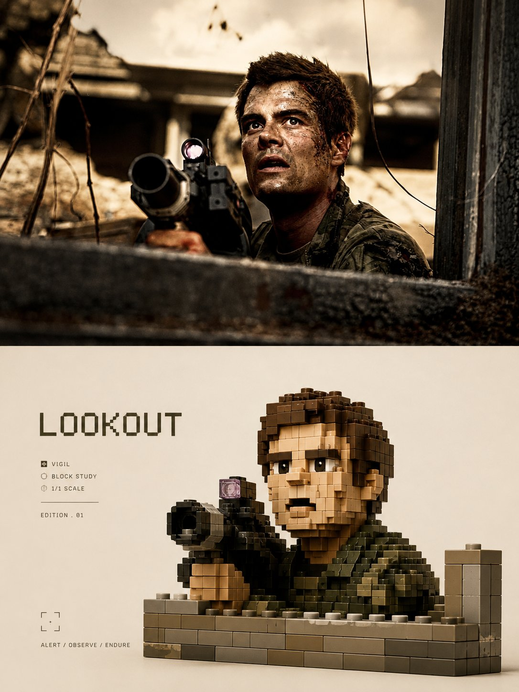

<p align="center">
  
</p>

<div align="center">

# 🦁 XXD Panel 035

### 사진을 선명하고 고급스러운 하나의 복셀 블록 컬렉터블로

[](./SKILL.md)
[](#네-가지-출력-하나의-복셀-조형-시스템)
[](#경계와-신뢰)

<a href="README.md">简体中文</a> · <a href="README.en.md">English</a> · <a href="README.ja.md">日本語</a> · <strong>한국어</strong> · <a href="README.ar.md">العربية</a>

</div>

> 하나의 블록 주체 · 원본 기반 선명한 색 · 무광 ABS · 조용한 배경 · 모듈형 글자

XXD Panel 035는 Codex와 호환 에이전트를 위한 이미지 생성 Skill입니다. 사진의 주체, 동작, 기능, 관계와 함의를 읽고, 최소 세 가지 고유 단서를 보존한 하나의 LEGO／Minecraft 계열 복셀 블록 조형으로 다시 만듭니다.

정육면체 비례, 단계, 두께, 이음새, 결합, 겹침과 하중을 설득력 있게 만들고, 원본에서 얻은 고순도 선명한 색, 무광 ABS 질감, 절제된 반사와 조용한 밝은 배경으로 단순 픽셀화가 아닌 프리미엄 컬렉터블을 완성합니다.

## 왜 035이 필요한가요

일반적인 ‘블록 변환’은 사진을 거칠게 픽셀화한 그림, 로우폴리 면, 게임 화면, 상품 사진 또는 주체와 무관한 고정 원색 세트로 쉽게 무너집니다.

035는 그 순서를 뒤집습니다.

```text
주체／동작／기능／관계／함의 해석 → 세 가지 이상 고유 단서 고정 → 하나의 블록 주체로 단순화 → 정육면체 비례와 조립 설계 → 두께／단계／이음새／결합／하중 성립 → 원본 기반 선명한 색 배분 → 무광 ABS와 접촉 그림자로 물질화 → 조용한 밝은 배경 배치 → 모듈 리듬에 글자 통합
```

무관한 사진으로 바꿔도 블록 윤곽, 비례, 동작, 기능, 관계, 색, 결합, 무게중심과 글자 배치가 거의 달라지지 않는다면 035가 아닙니다.

## 035의 시각적 원칙

- **원본 정체성:** 최소 세 가지 구체적 단서로 비율, 윤곽 흐름, 자세, 방향, 동작, 기능과 관계를 보존합니다.
- **하나의 블록 주체:** 하나의 대상 또는 분리할 수 없는 관계만 절대 초점으로 삼고 의인화를 강요하지 않습니다.
- **설득력 있는 조립:** 정육면체 비례, 모듈형 기하, 깨끗한 실루엣, 두께, 단계, 이음새, 결합, 겹침과 하중을 보여 줍니다.
- **원본 기반 선명한 색:** 고순도·고채도이되 원본의 전체 색 정체성을 지키며 고정 원색 키트, 네온, 파스텔, 회색 안개를 피합니다.
- **무광 ABS 물성:** 절제된 부드러운 반사, 믿을 수 있는 결합과 접촉 그림자를 사용하고 금속, 유리, 거울 광택, 녹은 덩어리, 과도한 CGI를 피합니다.
- **자유롭지만 근거 있는 배치:** 원본 방향과 무게가 편심, 가장자리, 필요한 크롭을 결정합니다.
- **모듈형 글자:** 대상 언어의 글자를 실루엣, 받침, 이음새, 모듈 리듬과 여백에 통합합니다.

## 예시 · X에서

> [샤오샤오둥（@xiaoxiaodong01）](https://x.com/xiaoxiaodong01/status/2090724386001015097) · 2026-08-21<br>
> GPT2 x 乐高 x 转绘 x 美学提示词 x VOL.035

<table>
  <tr>
    <td width="50%"><a href="https://x.com/xiaoxiaodong01/status/2090724386001015097"></a></td>
  </tr>
</table>

<p align="center"><a href="https://x.com/xiaoxiaodong01/status/2090724386001015097">원문 게시물과 전체 프롬프트 보기 →</a></p>

이 예시는 035의 미학적 의도를 보여 줄 뿐이며, 예시의 주제, 구성, 색상, 문구, 이전 캔버스 비율은 생성 참고나 현재 기본값이 되지 않습니다.

## 원본 프롬프트가 유일한 미적 기준입니다

`references/035-source.md`는 이 프로젝트의 유일한 창작·미적 기준입니다. Skill은 원문을 요약하거나 확장하지 않으며 공통 색상 계획, 미적 동기, 제목, 마이크로카피를 추가하지 않습니다. 색, 재료, 구성, 여백, 문구, 타이포그래피는 GPT Image 2가 원본 프롬프트의 규칙대로 수행합니다.

모드와 크기는 원본의 변환 미학을 바꾸지 않고 기존 3:4 상하 출력 컨테이너를 완전히 대체합니다. 각 결과물에는 선택된 하나의 모드 계약만 GPT Image 2에 전달하며, 네 가지 대안을 하나의 범용 템플릿에서 해석하게 하지 않습니다.

## 조합 가능한 네 가지 출력

`top-bottom`, `left-right`, `design-only`, `wallpaper-pack`을 하나 이상 선택할 수 있습니다. 여러 모드를 고르면 각 모드를 독립 프롬프트로 따로 생성합니다.

- `top-bottom`: 현실 화면은 위, 디자인 변환은 아래에 놓인 하나의 완성 캔버스입니다.
- `left-right`: 위에서 아래까지 좌우 구조를 유지하며 원본은 왼쪽, 디자인은 오른쪽에 둡니다. 문구도 이 구조 안에 통합하고 너비는 비대칭일 수 있습니다.
- `design-only`: 원본은 보이지 않는 참조이며, 보이는 모든 요소가 해당 Panel의 디자인 변환 언어를 따릅니다.
- `wallpaper-pack`: 각 기기마다 디자인 변환만으로 된 전체 화면 배경을 독립적으로 재구성합니다.

경계선, 중앙 비율, 픽셀 좌표는 측정하지 않습니다. 결정론적 합성은 사용자가 정확한 분할이나 원본 픽셀 보존을 명시한 경우에만 사용합니다.

일반 크기도 복수 선택할 수 있습니다: 자동 맞춤, 원본 비율, 1:1, 3:4, 4:3, 4:5, 5:4, 2:3, 3:2, 9:16, 16:9, 21:9, 5:7, 7:5, 사용자 비율／정확한 픽셀. 암묵적 기본 크기는 없습니다. 서로 다른 비율은 동일한 원본 프롬프트에서 각각 다시 구성합니다.

배경화면 세트는 연속형 또는 독립형입니다. 연속형은 먼저 기준 이미지 한 장을 만들고, 나머지는 원본 사진＋기준 이미지를 함께 참고해 각 기기에 맞게 재구성합니다. 한 이미지를 네 크기로 기계적으로 자르지 않습니다.

## 텍스트 모드

생성 전에 다음 중 하나를 정합니다.

1. **원본 프롬프트에 따라 모델이 텍스트 생성**: 사용자는 언어 또는 지역만 지정하고, 내용·분량·톤·타이포그래피는 GPT Image 2가 원문 규칙대로 생성합니다. 모든 문구는 현재 이미지의 내용·분위기·함의에서 나오며, 사실이나 자료처럼 보이는 정보는 사용자 제공·이미지에서 확인 가능·검증된 근거가 있어야 합니다.
2. **내 정확한 문구 사용**: 한 글자도 바꾸지 않고 전달하며 재작성, 번역, 제목 추가를 하지 않습니다. 배치는 원문을 따릅니다.
3. **텍스트 없음**: 모든 텍스트와 가짜 문자를 금지합니다.

외부 Skill은 제목이나 마이크로카피를 미리 쓰지 않습니다. 출력 언어는 인터페이스 언어와 별도로 확인하며 인물, 장면, 파일명에서 추정하지 않습니다.

## 완성 캔버스 우선과 래스터 경계

이미지 모델이 완성 화면 전체의 미학적 재구성을 담당하며 이중 패널도 완성 캔버스 한 장의 직접 생성을 기본으로 합니다. `scripts/compose_panel.py`는 조건부 복구, 무손실 픽셀 조정, 읽기 전용 검수에만 사용하고 매번 사전 계획하거나 미학적 성공을 판단하지 않습니다.

모든 결과물은 PNG 래스터이며 호출마다 `~/Desktop/xxd/`에 새 작업을 만듭니다. 설정된 이미지 경로는 비식별 상태만 반환하며 제공자, 엔드포인트, 인증 정보, 헤더, 프롬프트, 응답, 계정 정보를 공개하지 않습니다. SVG, HTML, Canvas, 도표와 프로그램 그림은 최종 작품을 대신할 수 없습니다.

## 호스트 기능에 맞춘 질문과 인라인 매개변수

같은 Skill이 호스트가 실제로 제공하는 상호작용 기능에 맞춰 동작하며 장식 기호를 클릭 가능한 UI처럼 보이게 하지 않습니다.

- **Claude Code에 `AskUserQuestion + multiSelect: true`가 있으면**: 모드와 크기는 실제 체크박스, 텍스트 방식과 배경화면 관계는 단일 선택을 사용합니다. 일반 크기는 정사각형·세로·가로 그룹으로 나누고 선택을 누적하며 사용자 크기는 자유 입력합니다.
- **Codex에 `request_user_input`만 있으면**: 텍스트 방식과 배경화면 관계처럼 상호 배타적인 항목에만 사용합니다. 모드와 크기를 단일 선택처럼 꾸미지 않고 조합 입력으로 받습니다.
- **상호작용 도구가 없으면**: 첫 번째 질문에서 모드, 두 번째 질문에서 크기＋텍스트 방식을 입력합니다. 가짜 `- [ ]`를 표시하지 않고 폼만을 위해 Plan mode 전환을 요구하지 않습니다.

두 번째 질문은 처음에 스마트 추천／원본 비율／일반 비율／사용자 지정만 보여 줍니다. 일반 비율을 선택할 때만 정사각형 `1:1`, 세로 `3:4, 4:5, 2:3, 9:16, 5:7`, 가로 `4:3, 5:4, 3:2, 16:9, 21:9, 7:5`를 펼칩니다. 여러 비율과 정확한 픽셀을 함께 지정할 수 있습니다.

모든 설정은 인라인으로도 전달할 수 있습니다.

```text
/xxd-panel-035 photo.jpg --mode top-bottom,design-only --size auto,3:4,9:16 --text prompt --locale ja-JP
```

`--mode`, 반복 가능한 `--size`, `--text prompt|exact|none`, `--locale`, `--copy`, `--wallpaper linked|independent`, `--wallpaper-size`, `--out`을 지원합니다. 값이 모두 있으면 질문을 건너뛰고, 일부만 있으면 누락된 항목만 묻습니다.

## 이미지 모델 우선순위

GPT Image 2를 기본 최우선 모델로 사용합니다. 고충실도 원본 참조, 생성 전 완성 캔버스 확인, 이중 패널의 완성 화면 일괄 생성, 조건이 충족될 때만 사용하는 스크립트 합성이라는 기존 흐름은 그대로 유지합니다.

현재 도구 또는 설정된 경로에서 실제로 사용할 수 있고 원본 충실도, 완성 화면비, 대상 언어의 문자, 연결형 배경화면의 다중 참조 요구를 충족할 때는 Seedance 5.0 Pro, Nano Banana Pro(Gemini Image Pro), Nano Banana 2(Gemini Image Flash) 또는 다른 호환 비트맵 모델도 사용할 수 있습니다. 대체 모델은 생성 경로만 바꾸며 모드, 캔버스, 문구, 언어, 배경화면 관계와 완성 캔버스 우선 전략을 바꾸지 않습니다.

적합한 경로가 없으면 이미지 생성 도구를 활성화하거나 API Key를 제공하도록 사용자에게 요청합니다. 사용자가 제공한 인증 정보는 현재 작업에 사용할 수 있지만 답변이나 로그에 다시 표시·기록·노출하지 않습니다. 사용자가 명시적으로 요청하지 않는 한 장기 저장하거나 제공자, 계정, 결제 또는 전역 경로 설정을 변경하지 않습니다.

## 시작하기

```bash
git clone https://github.com/nevertoday/xxd-panel-035.git
mkdir -p ~/.codex/skills
ln -s "$(pwd)/xxd-panel-035" ~/.codex/skills/xxd-panel-035
```

Claude Code 사용자는 같은 폴더를 `~/.claude/skills/xxd-panel-035`에 연결할 수 있습니다. 설치 후 에이전트 세션을 다시 시작하세요.

```text
$xxd-panel-035
이 사진을 좌우 구성으로 만들어 주세요. 문구는 사진의 의미에서 만들고 자연스러운 한국어를 사용하세요.
```

사진만 첨부해 호출해도 됩니다. 번호가 붙은 여러 줄 메뉴로 모드와 문구 설정을 확인하고, 배경화면 모드에서는 연결형／독립형과 기기 크기도 확인합니다.

전체 사양:

- [Skill 워크플로](SKILL.md)
- [중문 런타임 어댑터](references/xxd-panel-035-prompt.zh-CN.md)
- [영문 런타임 어댑터](references/xxd-panel-035-prompt.en.md)
- [원본 스타일 지시](references/035-source.md)

## 경계와 신뢰

- 각 사진은 독립된 작업 안에서만 사용하며 다른 입력, 과거 결과, 예시의 피사체, 색, 문구, 구도를 빌리지 않습니다.
- 호출할 때마다 새 작업 폴더를 만들고 원본과 조건이 같아도 새로 생성합니다.
- 결과물은 PNG 비트맵이며 SVG, HTML, Canvas, 프로그램 드로잉 대체물이 아닙니다.
- 설정된 비트맵 브리지는 정제된 상태만 출력하며 공급자, 엔드포인트, 헤더, 인증 정보, 프롬프트, 응답 본문을 노출하지 않습니다.
- 선택한 일반 모드마다 파일 1개를 반환하고, `wallpaper-pack`을 선택하면 독립 배경화면 4개를 추가합니다. `전체`는 원본 한 장당 PNG 7개를 네 개의 동급 모드 폴더에 저장하며 모음 이미지로 합치지 않습니다.

로컬 합성에는 Python 3와 Pillow가 필요합니다. 안전한 비트맵 브리지는 Python 3.11 이상의 `tomllib`을 사용합니다. 이미지 생성에는 내장 래스터 기능이 있는 호스트 에이전트 또는 이미 설정된 호환 경로가 필요합니다.

## 저장소

```text
xxd-panel-035/
├── SKILL.md
├── README.md / README.en.md / README.ja.md / README.ko.md / README.ar.md
├── agents/openai.yaml
├── assets/banner.svg + examples/ (향후 로컬 예시용)
├── scripts/compose_panel.py + configured_imagegen.py
└── references/xxd-panel-035-prompt.zh-CN.md + xxd-panel-035-prompt.en.md + 035-source.md
```

## XXD 소개

XXD는 Xiaoxiaodong의 브랜드 약칭입니다. 이 프로젝트는 [@xiaoxiaodong01](https://x.com/xiaoxiaodong01)이 만들고 관리합니다.

## 지원 및 멤버십

### 심층 상담 · CNY 299/시간

Skills 사용에 관한 일대일 상담은 시간당 CNY 299입니다. 아래 WeChat QR 코드로 예약하세요.

### Xiaoxiaodong Skills 사용자 교류방 · CNY 99

일회성 CNY 99를 내면 워크플로 공유, 작품 토론, 사용자 간 도움을 위한 교류방에 참여할 수 있습니다. 시간제 일대일 상담은 포함되지 않습니다.

### 지식성구＋회원 프롬프트 라이브러리 · CNY 699/년

[지식성구](https://wx.zsxq.com/group/15554814142882)와 [XXD 회원 프롬프트 라이브러리](https://vip.xiaoxiaodong.ai/)는 하나의 멤버십입니다. **연회비를 한 번 결제하면 두 서비스를 모두 이용할 수 있으며 추가 구매는 필요하지 않습니다.**

1. 지식성구에서 가입한 뒤 WeChat으로 프롬프트 라이브러리 교환 코드를 받습니다.
2. 프롬프트 라이브러리에서 가입한 뒤 WeChat으로 지식성구 초대를 받습니다.

<p align="center">
  <a href="https://xiaoxiaodong.pages.dev/assets/wechat-qr.png"></a>
</p>

<div align="center">

**현실 세계를 조립할 수 있게 만들되, 주체가 한눈에 보이는 이유는 잃지 않습니다.**

</div>

---

<div align="center">
  <h2>☕ 오픈 소스 프로젝트 후원하기</h2>
  <p>이 프로젝트가 시간을 아껴 주었다면 Star, 공유, 커피 한 잔으로 지속적인 개발을 응원해 주세요.</p>
  <table><tr><td align="center" width="240">
    <a href="https://github.com/nevertoday/zhongguo-traditional-colors/blob/main/docs/images/buy-me-a-coffee-qr.png?raw=true"></a><br>
    <strong>Buy me a coffee</strong><br><sub>QR 코드를 스캔하거나 열어 후원할 수 있습니다.</sub>
  </td></tr></table>
  <p><sub>후원은 전적으로 선택 사항이며 이 오픈 소스 프로젝트의 이용 권한에는 영향을 주지 않습니다.</sub></p>
</div>
